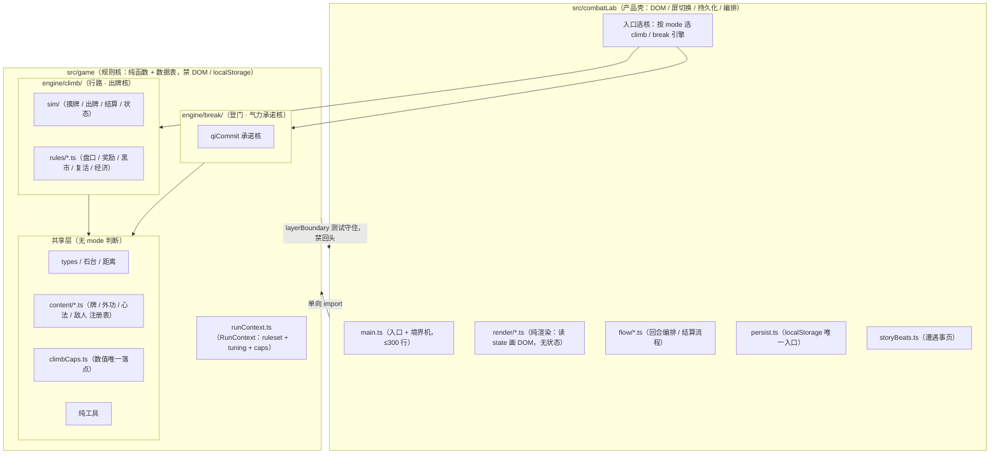
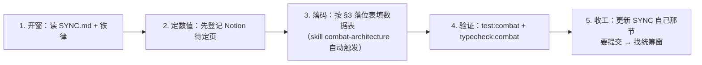
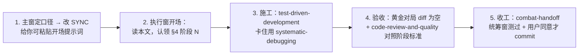

# Combat Lab 架构方案与开发规范

> 2026-09-21 主窗定稿，同日两轮评审修订（v2：H1–H5 / M1–M6；v3：C1–C6 精修，复评通过、具备开工条件）。
> 执行由专窗按阶段认领，每阶段验收标准见 §4。
> 配套：铁律 `.cursor/rules/combat-ironclad.mdc`（玩法）、`.cursor/rules/combat-architecture.mdc`（架构，简版）、skill `combat-architecture`（加内容时查）。
> 本文是架构唯一真源；改架构口径先改本文，再改 SYNC。

## 1. 目标架构



### 双模式终态（H1：收口 ≠ 解耦，这是终态结构）

登门（qiCommit 气力承诺制）与行路（sim 出牌制）是**两套结算核**，不是同一个核加开关。

| 共享（禁出现 mode 判断） | 分叉（各自模式核） |
|---|---|
| 石台 / 距离、types、content 注册表、纯工具 | `engine/climb/`（sim 出牌核 + 经济 / 奖励 / 复活规则）与 `engine/break/`（qiCommit 承诺核）并列 |

**数值 caps 按模式分套（C4）**：`climbCaps.ts`（行路）与 `breakCaps.ts`（登门：架势 12/8/14、气力 3/5、1/6 诱招等）并列，`ctx.caps` 按 mode 注入对应一套；共享层只放两核共用的常量。登门数值不许塞进 climbCaps。

**硬指标：共享结算主流程里 `ctx.ruleset.mode` 的判断数 = 0。** mode 只允许出现在两处：壳层入口选核、content 注册表上少量参数化字段。现存 146 处 `isBreakAlign()`（仅 sim.ts 就 38 处）要么归并进共享参数、要么沉到各自模式核，不允许留在共享结算路径里。**只把全局 if 换成 ctx if = 假重构，验收不通过。**

### 分层职责

| 层 | 目录 | 放什么 | 不放什么 |
|---|---|---|---|
| 规则核 | `src/game/` | 战斗模拟、规则函数、内容数据表、数值常量 | DOM、localStorage、屏切换、import 壳层、mode 判断（共享层） |
| 产品壳 | `src/combatLab/` | 渲染、事件绑定、屏切换、localStorage、遭遇文案、入口选核 | 规则判断、数值常量、战斗结算逻辑 |

归属判断一句话：**换个 UI 它还在不在？在 = 引擎，不在 = 壳。**

### 五条核心原则

1. **引擎纯函数化**：`f(state, ctx) → state'`。同样输入永远同样输出，测试即文档。
2. **运行态显式传递**：`RunContext` 作为参数走完整条调用链，没有模块级可变单例。
3. **内容数据驱动**：新牌 / 新敌人 = 注册表加一行数据 + 过校验测试，不改逻辑代码。
4. **壳层薄**：壳只做「把 state 画出来、把点击变成命令、按 mode 选核」，不含规则判断。
5. **双核并列**：climb / break 各自完整，共享层只有数据和纯工具。

## 2. 现状病灶（2026-09-21 实测基线；开工前必须重新 grep 基线化并写进任务卡）

1. **全局可变单例 + 双轨遥控**：`src/game/labRuleset.ts`、`src/game/labTuning.ts` 模块级 `let current`；`enterGauntletTuning()` 靠「快照-覆盖-恢复」。`isBreakAlign()` 非测试代码 **146 处**（sim.ts 38、gauntlet.ts 21、labV2.ts 14、damageBreakdown.ts 10，其余散布 20 个文件）。
2. **`main.ts` god module**：**4149 行**。渲染、回合编排、境界切换、结算、DOM 事件全在一起。
3. **壳层混规则 + 反向依赖**：`gauntlet.ts`（1843 行）约 600 行纯规则住壳层；main 上 `src/game` 反向 import `src/combatLab` 共 **11 个文件**（sim 4 处、damageBreakdown 3 处、labV21 2 处、stake 2 处等），PR #1 未合并前 layerBoundary 测试不可能绿。
4. **内容靠散表 + 特例**：牌 / 敌人 / 外功分散各表，加新内容要懂同步改哪些，错了运行期才炸；现有 `labMashBaseline.test.ts` 只看末馆胜率（统计量），抓不到单次结算漂移。
5. **rng 默认值洞**：`rng = Math.random` 默认参数 12 处（gauntlet 6、storyBeats 3、encounter 2、rogueRoster 1）——这些函数正是阶段 2 要搬进引擎的，不定规矩就会把不纯带进核里。

## 3. 新内容落位表（加东西前查这张）

| 要加什么 | 落点 | 配套动作 |
|---|---|---|
| 新牌 / 外功 / 心法 / 符 | `src/game/content/` 注册表加一行数据（注册表未落地前：labContent.ts / rogueCards.ts） | 数值先登记 Notion 待定页；跑 contentValidation 测试 |
| 新敌人 / 意图编排 | `src/game/content/enemies.ts`（落地前：labEnemyStress.ts） | 壳层 foes.ts 只做拼装 |
| 新常量 / 层帽 / 数值 | 行路 `src/game/climbCaps.ts`，登门 `breakCaps.ts`（壳层同名文件只 re-export） | 先改 Notion / 文档再改码 |
| 新赌注 / 奖励 / 黑市货 | **`src/game/rules/` 对应文件（目录随阶段 0 提前建好）** | 纯函数，入 ctx 出结果；**生效即冻结：gauntlet.ts 只减不增，不留 TODO-C 口子** |
| 新界面 / 新屏 | `src/combatLab/render/renderXxx.ts`（落地前：main.ts 加一个 case） | main.ts 不写渲染细节 |
| 新遭遇 / 事页 | `src/combatLab/storyBeats.ts` | 白描 6–10 句 + 2–3 选项，选项带机制数字（铁律 §3） |

## 4. 重构阶段（执行窗按 §6 认领；每阶段带验收 + 中止条件）

### 第 0 步：规范分发（C2，先于阶段 0，统筹窗）

- `.cursor/rules/combat-architecture.mdc` 落盘（全文在本窗计划文件）；`ARCHITECTURE.md` commit 入库。
- **不做这一步，前 5 个阶段只靠开场提示词自觉，规范等于没发。**

### 阶段 0：地基（PR #1 + 边界下沉 + 黄金对局 + 护栏）

PR #1 的合并判定标准 = **`src/game` 零 import `src/combatLab` + layerBoundary 测试绿**。为此先完成边界下沉清单（搬 canonical 进 game、壳层留 re-export）：

- `climbCaps`、`labRuleset` 的 mode 定义、`rogueRoster` 纯函数、`climbEconomy` 纯函数、`climbVitals`（PR #1 已含，未合并则在此补齐）。
- 同阶段建好空目录 `src/game/rules/`、`src/game/content/`。**签名空窗注意（C3）**：ctx 阶段 1 才落地，过渡期 `rules/` 目录注明「ctx 落地前不接新规则」；本阶段只接不依赖 ctx 的 content 数据表。

**黄金对局回放比对（H2 + C1，阶段 1/2/3/5 的强制验收闸门）**：

- **粒度**：快照打到「每个意图段 / 每次结算事件后」的 state（伤害 / 格挡 / 位移 / 状态层数 / 牌堆 / 蓝）；渲染层额外记录一条 **DOM 变更事件序列**——铁律 §4 是段间时序，最终 state 相同不代表渲染顺序没漂移，阶段 3 靠这条序列比对，不靠目检。
- **覆盖面**：20 局固定 seed 随机对局（覆盖六系 + 读招 / 行路双模式）**＋ 一组定向脚本场景**，专门走稀有规则分支：复活赛、期末三模板、断劲扣不动挂工资、桩爆炸、晕满手整回合跳过、堆挡盘口。
- 重构后同 seed 重放，逐拍 diff 必须为空。这是 Characterization Test，比新增单测更能防漂移。
- 落地为 `src/game/goldenReplay.test.ts` + 快照基线文件。

**护栏提前（M6）**：引擎禁 `document / window / localStorage` 的边界测试并入本阶段，与 layerBoundary 一起守——搬迁期最容易顺手在核里碰 DOM。

**冻结遗留（C6）**：`src/game/economy.ts`（含 L170 直连 `Math.random()`）、`bag.ts`、`progress.ts`、`quest.ts`、`rewards.ts`、`hooks.ts` 等被 `src/map/**` / `src/main.ts` 引用的文件是**主线遗留，归冻结区**——不进 rng 治理、不算战斗核，layerBoundary / DOM 护栏对它们豁免，随主线解冻再处理。

- **验收**：layerBoundary 绿 + DOM 护栏绿 + 黄金基线（随机 20 局 + 定向场景）已录制。
- **中止 / 回滚**：黄金基线录制时发现现行行为本身不确定（同 seed 两次跑不一致），先修确定性再继续。

### 阶段 1：RunContext + 双核拆分（单窗独占，单 PR，禁并行）

146 处分叉 + 全引擎签名加 ctx 是原子大改，**定为单窗独占、单个 PR、不合并不并行**；PR 内部按序分提交：

1. 叶子函数（damageBreakdown / intentPreview / stake）→ 2. labV2 / labV21 → 3. sim 核心。
2. 新建 `src/game/runContext.ts`：`RunContext = { ruleset, tuning, caps }` + `climbContext()` / `breakContext()` 工厂；删除 `get/setLabRuleset`、`get/setLabTuning` 全局态与快照-恢复机制。
3. **按 §1 双模式矩阵拆分**：共享层只留石台 / 距离 / types / content / caps / 纯工具；`isBreakAlign()` 146 处归并进共享参数或沉入 `engine/climb/`、`engine/break/` 各自核内。
4. 动 sim 时**先按摸牌 / 出牌 / 结算 / 状态做文件内分区**（零行为变化），为阶段 5 预埋边界（M2）。

- **入场券**：先补一组 `qiCommit` 黄金脚本（固定种子，录架势 / 气势 / 气力，以及每拍拆中 / 放生 / 墨痕 / 绝式）。现在的 `break-*` 基线走的是 sim 里 `ruleset="break"` 的分支，没有打到 `qiCommit.ts`。
- **验收**：typecheck + test:combat 绿；**黄金对局逐拍 diff 为空**；共享结算路径 `rg "ruleset.mode" src/game` 仅出现在入口 / content 参数化字段；`rg "isBreakAlign|getLabTuning|getLabRuleset" src/game` 无结果；`layerBoundary` 的 `PERSIST_DEBT` 白名单缩为空。
- **中止 / 回滚**：黄金 diff 不为空且 3 次修复内不收敛 → 回滚本阶段，保住分支现场报主窗。

### 阶段 2：gauntlet.ts 规则平移

- 纯规则约 600 行搬进 `src/game/rules/`：`wagerRules.ts`（盘口 / 结算）、`rewardRules.ts`（奖励滚池 / 超级奖励）、`marketRules.ts`（黑市）、`lifelineRules.ts`（复活 / 亡命线 / 带伤过馆）。函数签名带 ctx（依赖阶段 1）。
- 斩断引擎→壳层隐性回环：labEnemyStress 依赖的 foes 生成器，规则定义进引擎，壳层只拼装。
- 壳层 gauntlet.ts 只留屏切换 + re-export；localStorage 读写挪 `src/combatLab/persist.ts`。
- **rng 规矩（M5）**：搬进引擎的函数 rng 必传、无默认值；`rng = Math.random` 默认值只允许留在壳层注入处。
- **验收**：gauntlet.ts ≤600 行；layerBoundary + DOM 护栏绿；黄金对局 diff 为空。
- **中止 / 回滚**：同阶段 1。

### 阶段 3 ∥ 阶段 4：可并行（M1）

阶段 3 改壳、阶段 4 改核，文件集不重叠，**可分两窗并行**；若串行，**阶段 4 优先**——内容注册表直接解锁六系牌面 / 连携重写，避免牌面先在旧散表重写一遍再迁移做两次工。

### 阶段 3：main.ts 全量拆解

- 纵向切 `render/`（renderHand / renderIntent / renderHud / renderReward…）、`flow/`（turnFlow / settleFlow / screenFlow）、`dom/bindDom.ts`（事件绑定唯一入口）。
- 拆法：先切纯渲染（无状态、只读 state 画 DOM），再切编排；1028 行函数单独成文件再内部抽阶段。
- **铁律 §4 适配**：保持「这一招打完才改这一招的血 / 挡 / 位移」时序。
- **验收**：main.ts ≤300 行；测试绿；**渲染时序用黄金对局的逐拍快照比对**（不只目检）。
- **中止 / 回滚**：快照 diff 暴露时序漂移且 3 次修复不收敛 → 回滚该域拆分。

### 阶段 4：内容注册表 + 校验测试

统一注册表模式，字段契约样例（M4，多窗照此形状，不许自由发挥）：

```typescript
// src/game/content/cards.ts
export interface CardDef {
  id: CardId;            // 全局唯一，kebab-case
  cost: number;          // ≥1，不做 0 费牌（铁律）
  school: WeaponId | "any";
  kind: "attack" | "skill" | "stance";
  effectHooks: HookId[]; // 必须指向已存在的机制 hook
  values: Record<string, number>; // 数值字段须落在 climbCaps 声明的合法区间
  text: string;          // 牌面文案，带数字
}
export const CARD_REGISTRY: Readonly<Record<CardId, CardDef>> = { /* ... */ };
```

`contentValidation.test.ts` 校验项清单：

- id 全局唯一；cost ≥1；school / kind 枚举合法；
- 每个 effectHook 指向存在的机制；每个敌人引用的牌 / 意图 id 存在；
- 数值字段在对应 caps（climbCaps / breakCaps）声明区间内；牌面 text 含数字（铁律 §3 预演口径）。

**枚举先盘点再冻结（C5）**：`CardDef.kind` 写死前，先全量盘点现有牌型——绝招 / 位移 / 换人 / 共鸣 / 连携 / 光环能否都用 effectHooks 表达，盘点结果写进阶段任务卡再冻结枚举；敌人、外功、心法注册表**照同构字段**（id / cost 或档位 / school / kind / effectHooks / values / text），不许执行窗自由发挥新形状。

- **验收**：故意加一条坏数据（缺 hook / 0 费 / 越界数值），测试必红；删掉即绿。
- **中止 / 回滚**：现有内容大面积过不了校验 → 先修数据再上线校验门，不许放宽校验迁就旧数据。

### 阶段 5：清剿 + sim 拆分

- 清剿 `@deprecated` 兼容壳与死代码（`redeemGauntletRun` 等），不留历史包袱。
- sim（4877 行）按阶段 1 预埋的摸牌 / 出牌 / 结算 / 状态分区切 `src/game/sim/` 子模块。
- **验收**：sim 无文件超 800 行；测试全绿；黄金对局 diff 为空。黄金帧在阶段 5 动六系之前补上结构化层数：敌方裂创、双方破绽 / 连击 / 剑势 / 霸体 / 缴械 / 桩。不要只靠播报文本。

### 阶段 6：规范收口 + 分发

- 核对本文 §3 落位表与实际目录一致；AGENT.md 挂本文链接；SYNC.md 收件箱同步。
- `.cursor/rules/combat-architecture.mdc` 落盘、本文 commit——**分发到位前，这份真源只在本地，各窗看不到**。

## 5. 开发守则（每次开工自检）

1. **分层铁律**：`src/game/**` 禁 import `src/combatLab/**`、禁 DOM / localStorage（测试守住）。
2. **改数字先改文档**：常量唯一落点 climbCaps.ts + Notion 待定页；UI / 遭遇窗不自己编数字。
3. **新机制进数据表，不进 if**：牌 / 敌人 / 奖励做成注册表项；sim / main 禁止加内容特例分支。
4. **规则函数必须纯**：入 state + ctx，出新 state；不改全局、不读时间。**rng 在引擎内必传无默认值，默认值只允许壳层注入。**
5. **不可变更新约定**：返回新 state 时对改动路径做结构化拷贝；嵌套对象禁止浅拷贝后共享突变（拷贝边界 = 被修改的字段路径，未动字段可共享引用）。
6. **双轨判断只查一处**：共享结算路径 mode 判断数 = 0；mode 只在壳层入口选核 + content 参数化字段。
7. **每次改动后**跑 `npm run test:combat` + `npm run typecheck:combat`；不开页面手测；执行车道不 commit。吃随机发牌或敌方队列的单测必须 `setBattleRng` 或有序发牌，禁止裸 `Math.random`。全套件偶发失败算测试没写完。
8. **冻结区**不读不改：`src/map/**`、`src/story/**`、`docs/frozen/**`。
9. **体量红线**：文件超 300 行 = 该拆；函数超 80 行 = 该抽。**豁免：纯数据表 / 文案表**（storyBeats、content 注册表、ladder 表）不按行数计。
10. **命名约定**：规则文件 `src/game/rules/xxxRules.ts`；注册表导出 `XXX_REGISTRY`；ctx 字段固定 `ruleset / tuning / caps`；内容 id 用 kebab-case。

## 6. 分支、并行与车道认领（H5）

### 6.1 车道认领表

| 阶段 | 认领窗 | 说明 |
|---|---|---|
| 第 0 步 规范分发 | **统筹窗** | .mdc 落盘 + ARCHITECTURE commit |
| 阶段 0 地基（PR#1 / 下沉 / 黄金对局 / 护栏） | **统筹窗** | 黄金对局与边界测试是测试基建，正归测试与提交窗 |
| 阶段 1 RunContext + 双核拆分 | **行路玩法窗（单窗独占）** | sim / climb 核是它的地盘；期间登门窗冻结 sim，其他窗不碰引擎与 main.ts |
| 阶段 2 gauntlet 规则平移 | **行路玩法窗** | 盘口 / 奖励 / 黑市 / 复活都是行路规则 |
| 阶段 3 main.ts 拆解 | **UI 窗** | 纯壳层渲染拆分，与阶段 4 并行 |
| 阶段 4 内容注册表 + 校验 | **行路玩法窗** | 直接解锁六系牌面 / 连携重写；与阶段 3 并行 |
| 阶段 5 清剿 + sim 拆分 | **行路玩法窗** | 按阶段 1 预埋分区切 |
| 阶段 6 收口 + 分发核对 | **统筹窗** | 落位表与实际目录对齐、SYNC 同步 |
| — 登门日常（engine/break/、breakCaps） | 登门窗 | 阶段 1 冻结期不动 sim；之后 break 核归它 |
| — 遭遇事页（storyBeats） | 剧情文案窗 | 不涉重构，重构期间可继续；文案表豁免行数 |
| — 音乐音效 | 音频窗 | 待命，hook 约定不变 |
| — Godot 特效 | 未开 | 不派活 |

### 6.2 顺序与并行

- **总顺序**：第 0 步 → 0 → 1（独占）→ 3 ∥ 4 → 2 → 5 → 6。一次最多两个并行执行窗（既有纪律）。
- **重构期间战斗核功能冻结**：sim / 结算 / 规则函数停新需求；**纯注册表数据（新牌 / 新敌人）可继续**——正好倒逼阶段 4 提前。
- **阶段 1 单独开长生命周期 refactor 分支**，每日 rebase main；单窗独占。
- 阶段 0 / 2 / 5 尽量在 main 上串行、每阶段当天合；阶段 3 ∥ 4 两窗并行（文件集不重叠：壳 vs 核）。
- 任何阶段超过 2 天未合，回主窗重新对齐基线（行数 / import 数 / isBreakAlign 数重新 grep）。

## 7. 开发流程（什么时候用什么）

### 7.1 日常加内容（小改，任一业务窗）



### 7.2 重构 / 大改（执行专窗）



### 7.3 时机速查

| 时机 | 用什么 | 怎么用 |
|---|---|---|
| 每次开窗 / 闲置几天后回来 | `.cursor/lanes/SYNC.md` | 必读，现行板；不要从旧聊天猜规则 |
| 改玩法规则 / 战斗骨架 | `.cursor/rules/combat-ironclad.mdc` + `docs/combat/RULES.md` | 先改文档再改码；铁律冲突先不落地，问用户 |
| 加任何新内容 | skill `combat-architecture`（自动触发）+ 本文 §3 | 查落位表 → 填数据 → 跑自检清单 |
| 写代码时约束自己 | rule `combat-architecture`（alwaysApply，自动加载） | 不用手动调，违反即返工 |
| 不确定代码放哪 / 重构方向 | 本文 §1 + §3 | 归属判断：换个 UI 它还在不在？ |
| 写引擎逻辑 / 修 bug | skill `test-driven-development` / `systematic-debugging` | 先写测试再实现 / 先复现再修 |
| 阶段验收 / 合并前 | 黄金对局 diff + skill `code-review-and-quality` | 对照 §4 该阶段验收 + 中止条件 |
| 收工换窗 / 长对话交接 | skill `combat-handoff` + 更新 SYNC 自己那节 | 下一窗冷启动能接上 |
| 提交代码 | 统筹窗 | 系统测试过 + 用户同意才 commit；执行窗禁 commit |

（上述 skill 均已核对存在于 `.cursor/skills/`。）

### 7.4 给执行窗的开场提示词（模板）

> 读 `docs/combat/ARCHITECTURE.md`，认领阶段 N，按该阶段验收 + 中止条件执行。先 grep 重新基线化（行数 / import 数 / isBreakAlign 数）写进任务卡。准许文件：〈按阶段列〉；禁止：commit、开页面手测、碰冻结区。收工前跑 `npm run test:combat` + `npm run typecheck:combat` + 黄金对局 diff。

## 8. 风险与对策

- **阶段 1 是最大单次改动**（146 处分叉 + 全引擎签名）：单窗独占 + PR 内分提交 + 黄金对局闸门；typecheck 列出所有调用点，编译器带着改。
- **阶段 3 行为漂移风险**：不靠目检，用黄金对局逐拍快照比对渲染时序。
- **顺序约束**：0 → 1 → 2 严格串行；3 ∥ 4 可并行；5 在 1 之后；6 最后。
- **基线漂移**：本文 §2 数字是 2026-09-21 实测；每个阶段开工前重新 grep 基线化，不许拿旧数字估工作量。
